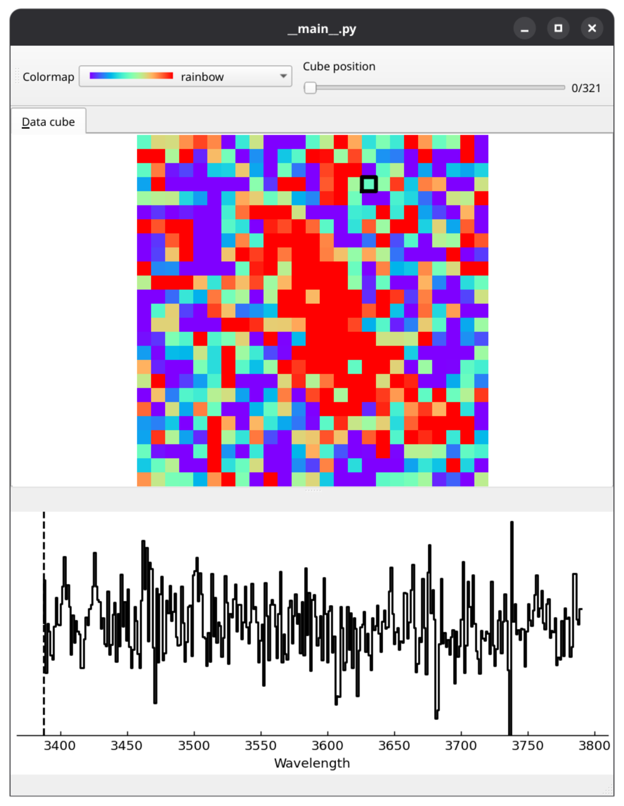
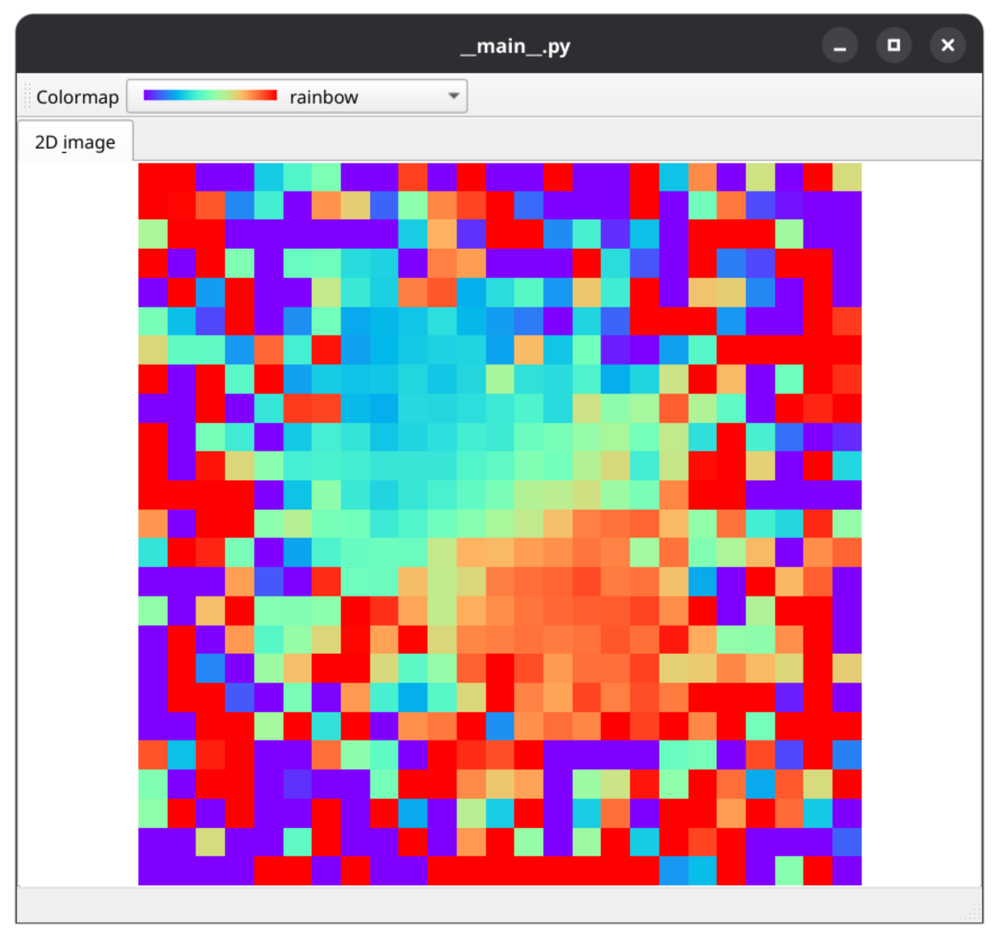
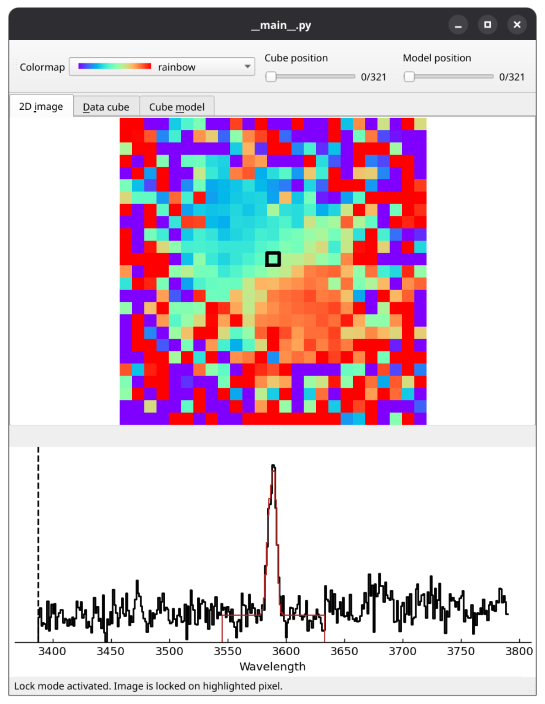

# EZQubeVis

A simple interface (heavily) inspired by [PyQubeVis](https://gitlab.lam.fr/bepinat/PyQubeVis/-/tree/master?ref_type=heads) to open products from [CAMEL](https://gitlab.lam.fr/bepinat/CAMEL) for vizualization and cleaning purposes.

Credits for the interface design and basic interactions goes to [B. Epinat (LAM)](https://gitlab.lam.fr/bepinat). 

Similarly to [PyQubeVis](https://gitlab.lam.fr/bepinat/PyQubeVis/-/tree/master?ref_type=heads), this program is published with the GNU GPL V3.0 licence.

## Installation

To install the environment to run the code, use

```
conda create --file environment.yaml
conda activate EZQubeVis
```

## Running examples

One can get help on how to run the code with

```
python __main__.py -h
```

An example can be found in the `examples/example1` directory

### Opening a 3D data cube

To show a data cube, use the following command

```
python __main__.py -c examples/example1/out_cube_cut_clip.fits
```

The interface should look as follows



The image represents a slice of the cube at the given cube position which can be changed with the slider. The bottom spectrum represents the spectrum extracted at the position of the mouse cursor on the image. It is possible to lock the mouse cursor by pressing the `L key`.

### Opening a 2D velocity field

To show a velocity field, use the following command

```
python __main__.py -i examples/example1/out_vel_common.fits
```

The interface should look as follows



In this case, no spectrum is shown because the input file is not a 3D cube.

### Opening a cube + velocity field + velocity field model

Finally, it is also possible to load at the same time the 3D data cube, the associated velocity field, and the best-fit cube model using

```
python __main__.py -i examples/example1/out_vel_common.fits -c examples/example1/out_cube_cut_clip.fits -m examples/example1/out_modcube.fits
```

The interface looks as follows



In this case, the best-fit model is overlayed on top of the spectrum for each pixel hovered on by the mouse cursor.